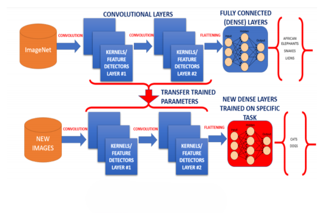
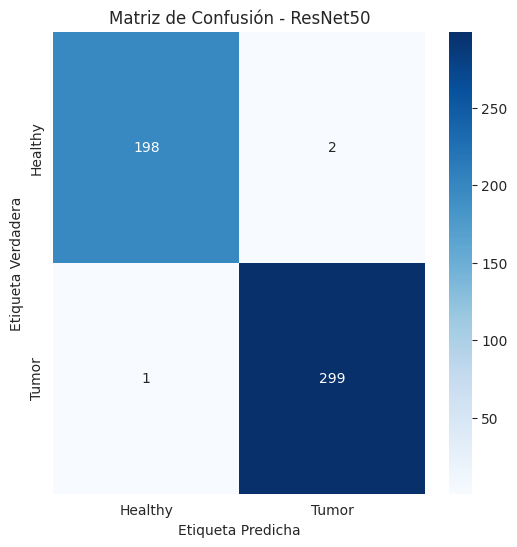
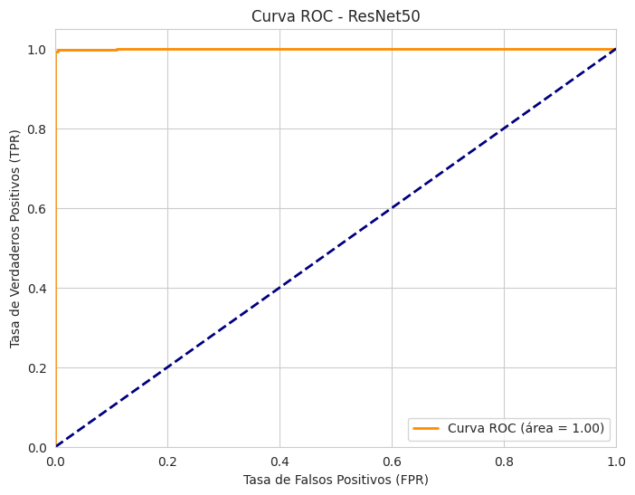
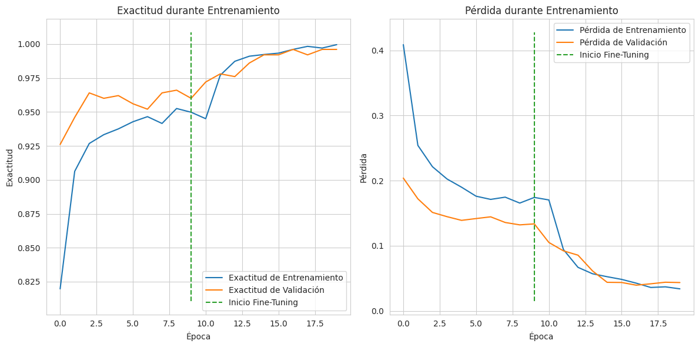

# Clasificación de Imágenes Médicas con ResNet50 🧠🔬

Este repositorio documenta un proyecto para la clasificación de imágenes médicas, distinguiendo entre imágenes "Healthy" y con "Tumor". Se utiliza un modelo de Deep Learning basado en la arquitectura ResNet50, implementado con TensorFlow y Keras.  

Las imágenes utilizadas para el entrenamiento se encuentra en el siguiente repositorio de Kaggle:
https://www.kaggle.com/code/nirmalgaud/brain-tumor-classification-with-fibonaccinet/input

---

## Conceptos relacionados

### La red neuronal convolucional (CNN)
Es un tipo de red neuronal profunda que está diseñada para procesar eficazmente datos en cuadrícula o píxeles, como imágenes. Consisten en capas de filtros convolucionales que aprenden representaciones jerárquicas de las características dentro de los datos de entrada. Las CNN se utilizan ampliamente en tareas como la clasificación, la detección y la segmentación de imágenes.


### Residual Network (ResNet)
Son un tipo de red neuronal profunda que utiliza **conexiones de salto** (o *skip connections*) para mejorar el aprendizaje en modelos con muchas capas. Estas conexiones permiten que la información pase directamente entre capas no consecutivas, lo que ayuda a **evitar el problema del gradiente desvanecido**, una dificultad común en redes profundas donde los gradientes se vuelven muy pequeños al retropropagarse.

A diferencia de redes tradicionales, donde cada capa solo se conecta con la siguiente, en ResNet **la entrada de un bloque también se suma a su salida**, creando un atajo que facilita el flujo de información y mejora la actualización de los pesos durante el entrenamiento. Esto se implementa frecuentemente usando una función identidad, lo que asegura que el gradiente se conserve sin modificaciones.

Una arquitectura típica de ResNet incluye filtros de **convolución 3x3**, capas de **submuestreo** (stride 2), **agrupación promedio global** y una capa final **completamente conectada con softmax**.

ResNet ha demostrado ser muy eficaz en tareas de visión por computadora, como clasificación de imágenes, al permitir construir redes muy profundas sin pérdida de rendimiento.


### Aprendizaje por Transferencia (Transfer Learning)

El **aprendizaje por transferencia** es una técnica de aprendizaje automático que permite **reutilizar el conocimiento aprendido por un modelo en una tarea para resolver otra tarea relacionada**. A diferencia del enfoque tradicional, donde cada modelo se entrena desde cero para tareas específicas, el aprendizaje por transferencia parte de un **modelo preentrenado**, lo que **reduce el tiempo de entrenamiento y mejora el rendimiento** cuando los datos disponibles son limitados.

Este enfoque es especialmente útil cuando los datos de entrenamiento y los datos futuros **no comparten la misma distribución o espacio de características**, algo común en problemas del mundo real. Por ejemplo, podríamos tener muchos datos en un dominio (fuente) y pocos en otro (destino), pero si las tareas están relacionadas, **transferir el conocimiento puede ser muy eficaz**.

Los humanos usamos este principio de forma natural: aplicamos conocimientos previos para resolver nuevos problemas similares. El aprendizaje por transferencia lleva esta capacidad al campo de las máquinas, **rompiendo el paradigma del aprendizaje aislado**.

Cuanto **más similares sean las tareas**, más efectiva será la transferencia. Es una herramienta clave en áreas como visión por computadora, procesamiento del lenguaje natural y más.



---


## 🚀 Estructura del Proyecto 

La estructura del proyecto es la siguiente:

```bash
Brain_tumor_detection/
│
├── app.py                     # App de Streamlit
├── requirements.txt           # Dependencias del proyecto
├── README.md                  # Descripción general
│
├── model/
│   └── final_resnet_model.h5 # Modelo entrenado (vía Git LFS)
│
├── notebooks/
│   └── tumor_detection_pipeline.ipynb  # Notebook de desarrollo / entrenamiento
│
├── Images/
│   ├── confussion_matrix.png
│   ├── training_history.png
│   └── transfer_learn.png    # Usadas en README.md
│
└── .gitattributes             # Git LFS configurado para .h5
```

El proyecto se organiza en cuatro bloques funcionales principales:

### Bloque 1: **Configuración Inicial y Carga de Datos** 📂
Esta fase establece el entorno básico y carga el conjunto de datos de imágenes.
- Se preparan las herramientas necesarias, siendo **TensorFlow** el framework principal para el modelado.
- Como datos tenemos 5000 imágenes de resonancia magnética que se cargan desde un sistema de archivos estructurado, donde las rutas y sus correspondientes etiquetas (ej. "Healthy" con 2000 imágenes , "Tumor" con 3000 imágenes) se organizan en un formato manejable, típicamente un DataFrame de Pandas.

### Bloque 2: **Preprocesamiento y Generadores de Imágenes** 🖼️➡️🔢
Antes del entrenamiento, los datos de imágenes requieren una preparación significativa:
- **Codificación de Etiquetas**: Las etiquetas textuales de las clases se convierten a un formato numérico.
- **División de Datos**: El dataset se divide en conjuntos de entrenamiento (80%), validación(10%) y prueba(10%).
- **Generadores de Datos (`ImageDataGenerator`)**: Se configuran generadores para alimentar eficientemente al modelo:
    - Para el entrenamiento, se aplica **aumentación de datos** (rotaciones, zoom, etc.) y el preprocesamiento específico de ResNet.
    - Para validación y prueba, solo se aplica el preprocesamiento de ResNet, sin aumentación, para una evaluación objetiva.

### Bloque 3: **Construcción y Entrenamiento del Modelo ResNet50** 🧠🔧
Aquí se define la arquitectura del modelo de Transfer Learning y se lleva a cabo el proceso de entrenamiento:
- **Modelo Base ResNet50**: Se carga la arquitectura ResNet50 pre-entrenada, sin su capa clasificadora original.
- **Capas Personalizadas**: Se añaden capas superiores (ej. GlobalAveragePooling, Dropout, Dense con activación sigmoide) para adaptar el modelo a la tarea de clasificación binaria.
- **Entrenamiento en Dos Fases**:
    1.  **Entrenamiento del Clasificador**: Inicialmente, solo se entrenan las capas personalizadas nuevas, manteniendo congelado el modelo base ResNet50. Se establece la ejecución de 10   epocas en esta primera fase, obteniendose estos resultados:
       
       accuracy: 0.9484 - auc: 0.9888 - loss: 0.1678 - val_accuracy: 0.9520 - val_auc: 0.9937 - val_loss: 0.1444 - learning_rate: 0.0010
    3.  **Fine-Tuning**: Posteriormente, se descongela el modelo base ResNet50 (o parte de él) y se continúa el entrenamiento de todo el modelo con una tasa de aprendizaje más baja para un ajuste fino. Se agregan 10 épocas adicionales para el fine-tuning, obteniendo una mejora en los resultados:

       accuracy: 0.9973 - auc: 1.0000 - loss: 0.0392 - val_accuracy: 0.9960 - val_auc: 0.9999 - val_loss: 0.0395 - learning_rate: 1.0000e-05
- **Callbacks**: Se utilizan `EarlyStopping`, `ModelCheckpoint` y `ReduceLROnPlateau` para gestionar el entrenamiento, guardar el mejor modelo y ajustar la tasa de aprendizaje dinámicamente.

### Bloque 4: **Evaluación del Modelo y Visualización de Resultados** 📊📈
Finalmente, se evalúa el rendimiento del modelo entrenado utilizando el conjunto de prueba:

- **Matriz de Confusión**.

  Realizada sobre la base de test, muestra una precisión del 99%
  
     

- **Reporte de Clasificación** (precisión, recall, F1-score).
 
  ### 📊 Reporte de Clasificación

```
                          precision    recall  f1-score   support

              Healthy       0.99      0.99      0.99       200
                Tumor       0.99      1.00      1.00       300
              accuracy                           0.99       500
             macro avg       0.99      0.99      0.99       500
          weighted avg       0.99      0.99      0.99       500
```
 

- **Curva ROC**.
  
  
  
- Se grafica el **historial de entrenamiento** (pérdida y exactitud a lo largo de las épocas) para analizar el proceso de aprendizaje.
  
   
  

## 🛠️ Despliegue en streamlit

- Se ejecuta un MVP desplegado en la plataforma Streamlit para probar el modelo con imagenes nuevas

 https://braintumordetection-1.streamlit.app/


## 🔬 Tecnologías Clave

*   **Python**
*   **TensorFlow / Keras**
*   **ResNet50 (Transfer Learning)**
*   **Pandas, NumPy, Scikit-learn, Matplotlib**
